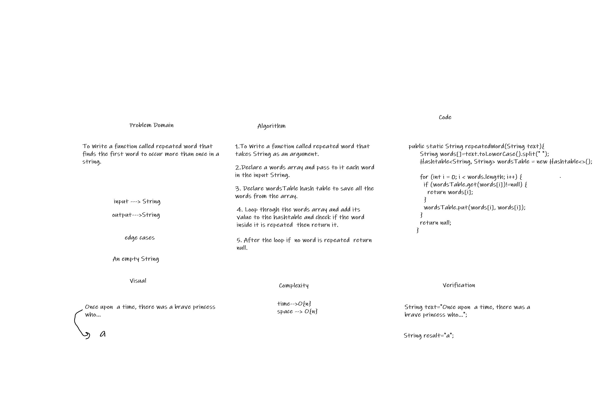
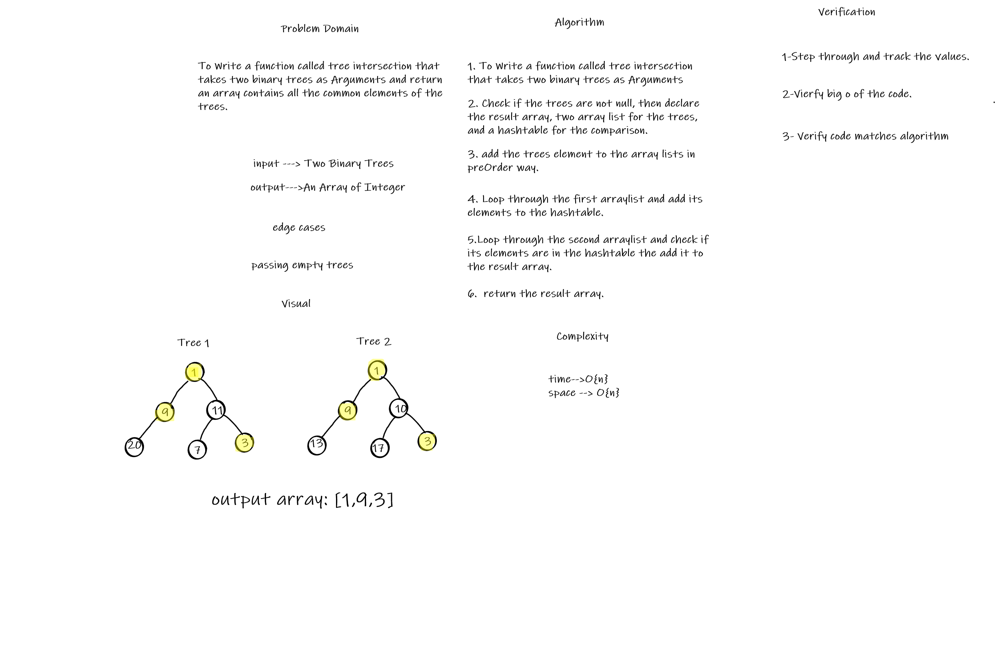

# Hashtables

Hashtables are a data structure that utilize key value pairs. This means every Node or Bucket has both a key, and a value.

## Challenge

Implement a Hashtable Class with the following methods:

* add, get, contains, hash

## Approach & Efficiency

* Big O(n)

## API

* add: add the key and value pair to the table
* get: Returns: Value associated with that key in the table
* contains: Check  key exists in the table already.
* hash: Returns Index in the collection for that key

# Repeated-Word

## Challenge Summary

To Write a function called repeated word that finds the first word to occur more than once in a string.

## Whiteboard Process

## Approach & Efficiency

* Time: O(n)
* Space: O(n)

# Tree-Intersection

## Challenge Summary

To Write a function called tree intersection that takes two binary trees as Arguments and return an array contains all the common elements of the trees.

## Whiteboard Process

## Approach & Efficiency

* Time: O(n)
* Space: O(n)
