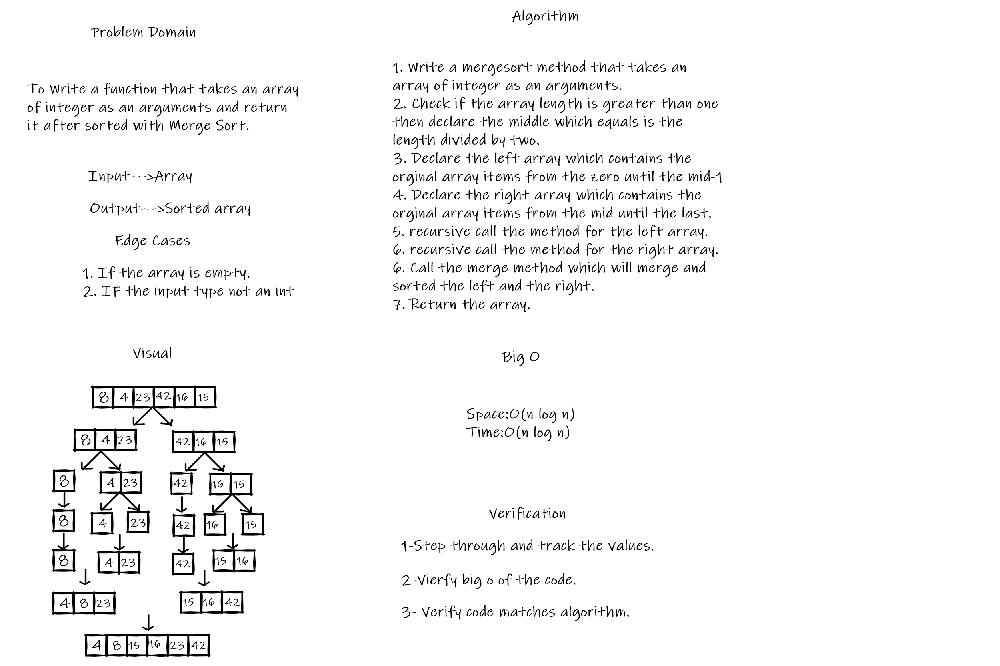

# MergeSort

## Challenge Summary

To Write a function that takes an array of integer as an arguments and returnit after sorted with Merge Sort.

## Whiteboard Process

## Approach & Efficiency

* Space:O(n log n)
* Time:O(n log n)
