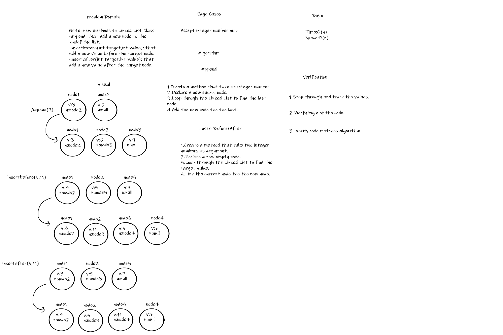

# Singly Linked List
A data structure that contains nodes that links to the next node in the list.

## Challenge
Create a Node class, Create a Linked List class which contain the following methods (insert, includes, to string)

## Approach & Efficiency

* Time Big O **O(n)**
* Space Big O **O(1)**

## API

* insert: Adding a new node to the Linked List
* includes: Check if the Linked List contain a certain value.
* to string: Return all the values in the Linked List.

### Challenge 06:

* Append: Adding a new node to the end of the Linked List.
* InsertBefore: Adding a new node before the target node in the the Linked List.
* InsertAfter: Adding a new node after the target node in the the Linked List.

## Whiteboard Process 

