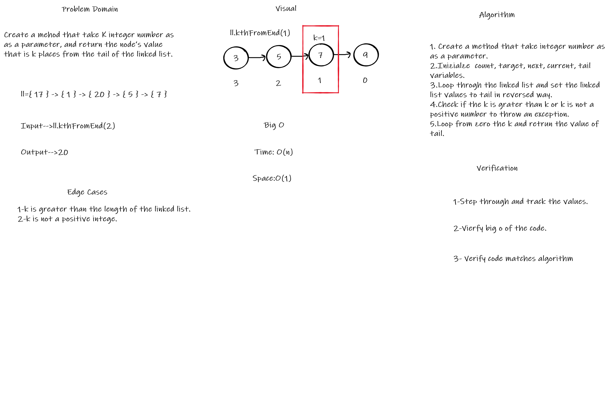
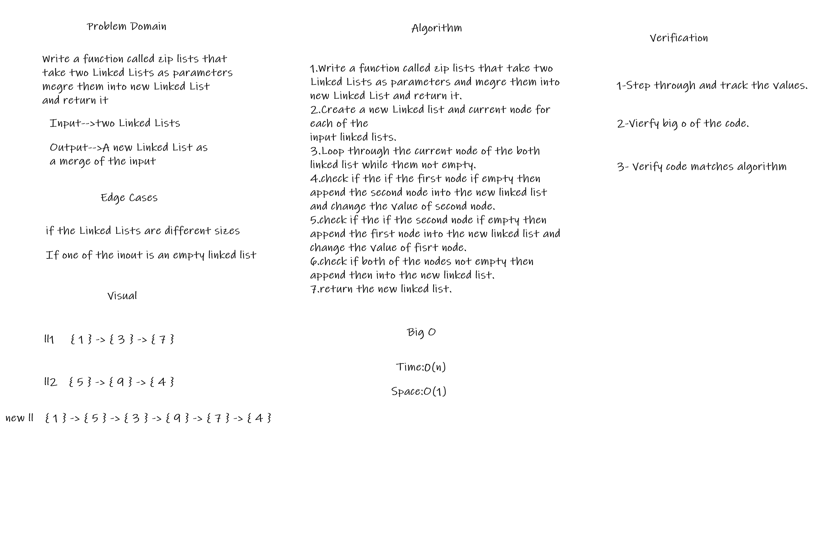

# Singly Linked List
A data structure that contains nodes that links to the next node in the list.

## Challenge
Create a Node class, Create a Linked List class which contain the following methods (insert, includes, to string)

## Approach & Efficiency

* Insert
    * Time Big O **O(1)**
    * Space Big O **O(1)**
* includes
    * Time Big O **O(n)**
    * Space Big O **O(1)**  
* toString 
    * Time Big O **O(n)**
    * Space Big O **O(1)**
* Append    
    * Time Big O **O(n)**
    * Space Big O **O(1)**
* InsertBefore  
    * Time Big O **O(n)**
    * Space Big O **O(1)**
* InsertAfter  
    * Time Big O **O(n)**
    * Space Big O **O(1)**    
## API

* insert: Adding a new node to the Linked List
* includes: Check if the Linked List contain a certain value.
* toString: Return all the values in the Linked List.

### Challenge 06:

* Append: Adding a new node to the end of the Linked List.
* InsertBefore: Adding a new node before the target node in the the Linked List.
* InsertAfter: Adding a new node after the target node in the the Linked List.

## Whiteboard Process 

# Challenge 07: kth from end
Create a method that take K integer number as as a parameter, and return the node’s value that is k places from the tail of the linked list.

## Whiteboard Process

## Approach & Efficiency

* Time Big O **O(n)**
* Space Big O **O(1)** 

# Challenge 08: linked-list-zip
Create a method called zip lists that take two Linked Lists as parametersmegre them into new Linked List and return it.

## Whiteboard Process

## Approach & Efficiency

* Time Big O **O(n)**
* Space Big O **O(1)** 

