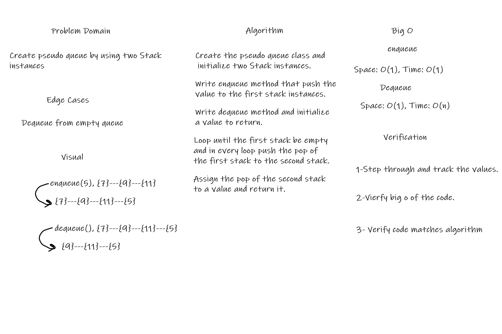
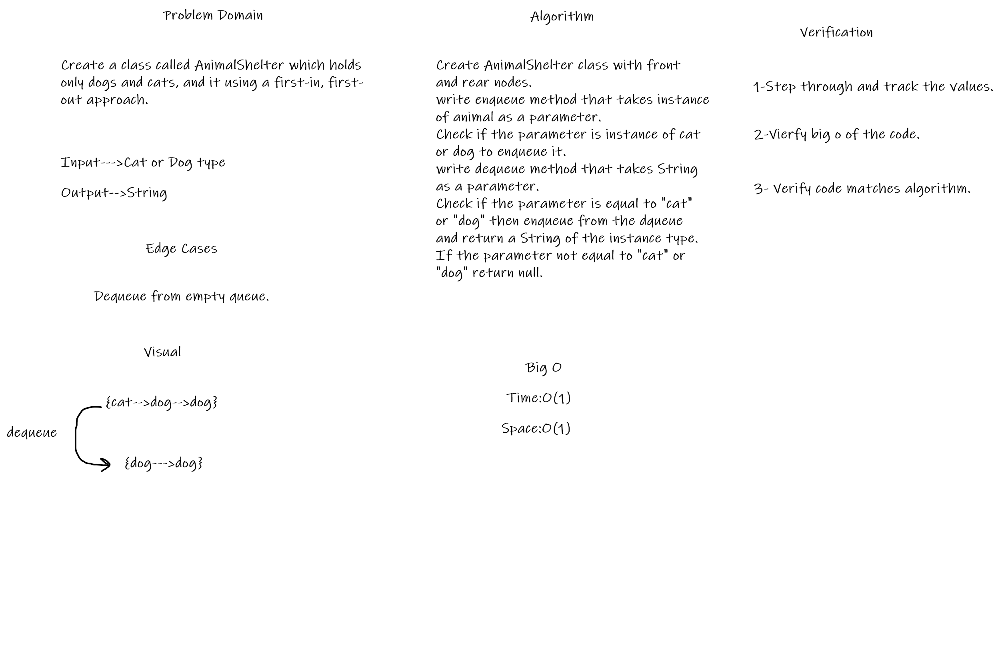

# Stacks and Queues

## Challenge
This Challenge is about implement Stacks and  Queues

## Approach & Efficiency

 * push & pop & peek & enqueue & dequeue & is empty
     * Time Big O **O(1)**
     * Space Big O **O(1)**

## API

* Stack

   * push: Adds a new node with that value to the top of the stack 
   * pop: Removes the node from the top of the stack and return the value of top.
   * peek: Return the value of top.
   * isEmpty: Returns: Boolean indicating whether or not the stack is empty.

* Queue   

  * enqueue: Adds a new node with that value to the back of the queue.
  * dequeue: Removes the node from the front of the queue and Returns front value.
  * peek: Returns front value.
  * isEmpty: Returns: Boolean indicating whether or not the queue is empty.

## Challenge 11:
Create PseudoQueue class by using two Stack instances.

## Whiteboard Process

## Approach & Efficiency

* enqueue
   * Time Big O **O(1)**
   * Space Big O **O(1)**
 * dequeue
   * Time Big O **O(n)**
   * Space Big O **O(1)**

## API

* enqueue : Insert a value into the PseudoQueue using, FIFO approach.
* dequeue: Extract a value from the PseudoQueue using, FIFO approach.

## Challenge 12:
Create a class called AnimalShelter which holds only dogs and cats, and it using a first-in, first-out approach.

## Whiteboard Process

## Approach & Efficiency

* enqueue
   * Time Big O **O(1)**
   * Space Big O **O(1)**
 * dequeue
   * Time Big O **O(n)**
   * Space Big O **O(1)**

## API

* enqueue : Insert an instance of animal type of dog or cat into the Queue using, FIFO approach.
* dequeue: Extract a value from the Queue using, FIFO approach.
