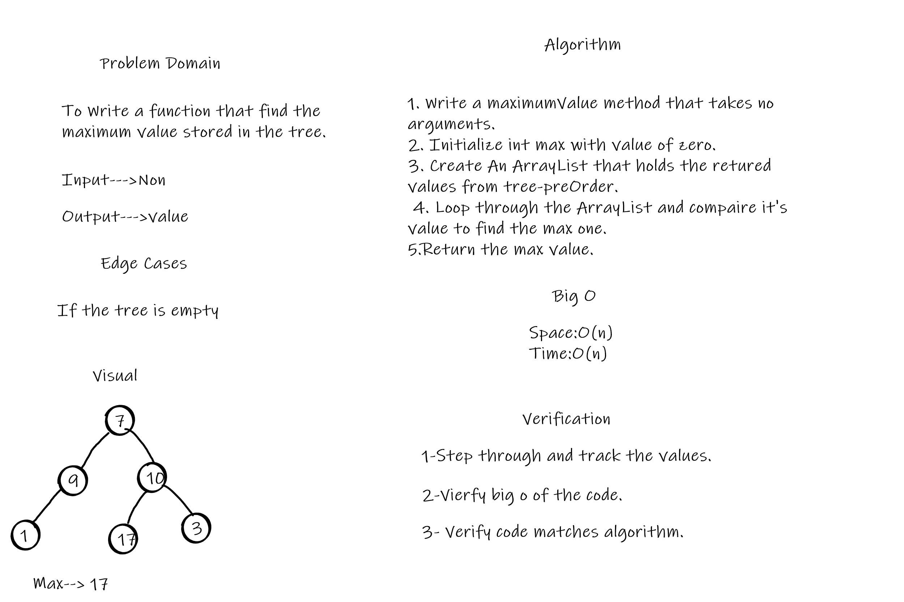
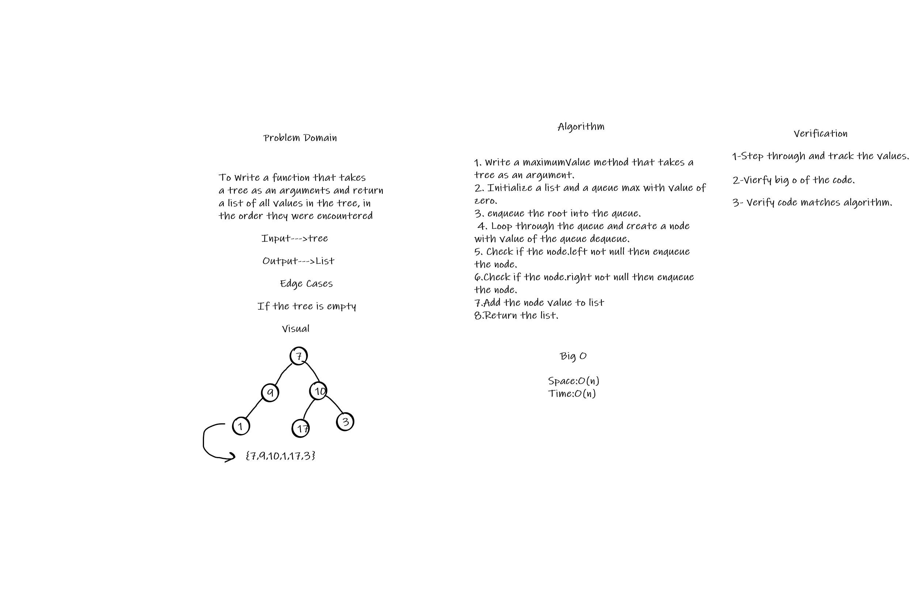

# Trees
A tree data structure is defined as a collection of nodes that are linked together to represent hierarchy. 

## Challenge
This Challenge is about implement Binary Tree and Binary Search Tree.

## Approach & Efficiency
Add & Contains:

 * Time Big O **O(1)**
 * Space Big O **O(1)**

## API
* Add: Adds a new node with that value in the correct location in the binary search tree.
* Contains: Returns: boolean indicating whether or not the value is in the tree at least once.

# Challenge 16:
To Write a function that find the maximum value stored in the tree.

## Whiteboard Process

## Approach & Efficiency
* maximumValue
     * Time Big O **O(n)**
     * Space Big O **O(n)**

## API
* maximumValue: Find the maximum value stored in the tree.

# Challenge 17:
To Write a function that takesa tree as an arguments and returna list of all values in the tree, in the order they were encountered.

## Whiteboard Process

## Approach & Efficiency
* breadthFirst
     * Time Big O **O(n)**
     * Space Big O **O(n)**

## API
* breadthFirst: takes a tree and return a list list of all values in the tree in Breadth-first order.